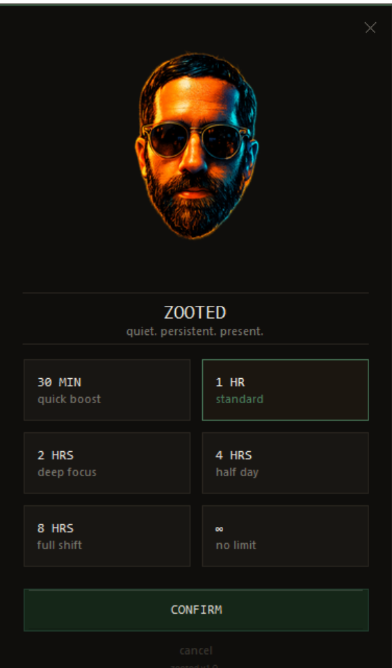

# Zooted

**Keep your Windows PC awake without touching a single power setting.**

Zooted sits in your system tray, holds a `SetThreadExecutionState` wake lock for as long as you tell it to, then quietly steps aside. That's the whole deal.

---

## Features

- **Duration presets** — 30 min, 1 hr, 2 hrs, 4 hrs, 8 hrs, or indefinite. Pick one at launch or switch any time from the tray.
- **Keep display on** — prevents the monitor from blanking out, not just system sleep.
- **Timer with notifications** — get a toast when 5 minutes are left, and another when Zooted deactivates.
- **Loop on expiry** — auto-restart the timer when it runs out, for the truly unattended workflows.
- **Optional startup picker** — show the duration screen on launch, or skip it and go straight to the tray (configurable).
- **Launch at Windows startup** — set it and forget it.
- **Persistent logging** — every activation, deactivation, and `SetThreadExecutionState` call is written to `%APPDATA%\Zooted\zooted.log` (capped at 1 MB, auto-rotated).
- **Single-instance** — double-clicking again does nothing; the tray icon is already there.
- **No installer, no admin rights** — just a single `.exe`.

---

## Screenshot

<!-- TODO: drop a screenshot here -->


---

## Installation

No Python required. Just grab the latest release:

**[Download Zooted.exe → GitHub Releases](https://github.com/christhomas2131/zooted/releases/latest)**

Drop the `.exe` anywhere and run it. Settings are saved to `%APPDATA%\Zooted\config.json`.

---

## Build from source

Requires **Python 3.11+** (developed on 3.14) and a Windows machine.

```bat
# 1. Install dependencies
pip install -r requirements.txt

# 2. Build — one-file Windows executable, no console window
build.bat
```

The finished binary lands at `dist\Zooted.exe`.

If you want to run the script directly without building:

```bat
pip install -r requirements.txt
python zooted.py
```

### Manual PyInstaller command

```bat
pyinstaller ^
    --onefile ^
    --noconsole ^
    --name Zooted ^
    --icon=cartoon_dock_icon.ico ^
    --add-data "logo_zoot.png;." ^
    --add-data "icon_v2.png;." ^
    --hidden-import win10toast ^
    --hidden-import plyer ^
    --hidden-import plyer.platforms.win.notification ^
    zooted.py
```

---

## License

MIT — do whatever you want with it.
